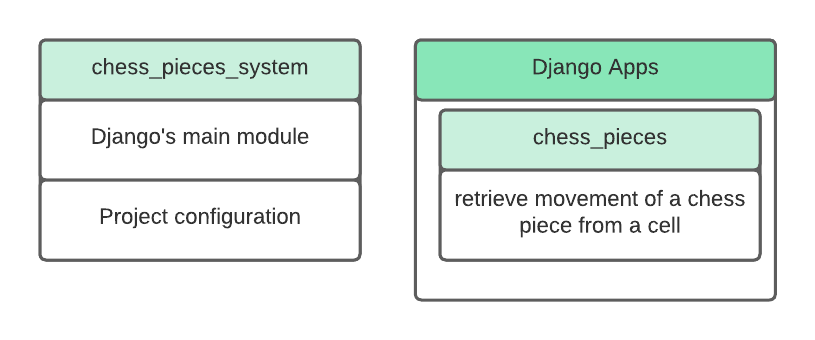
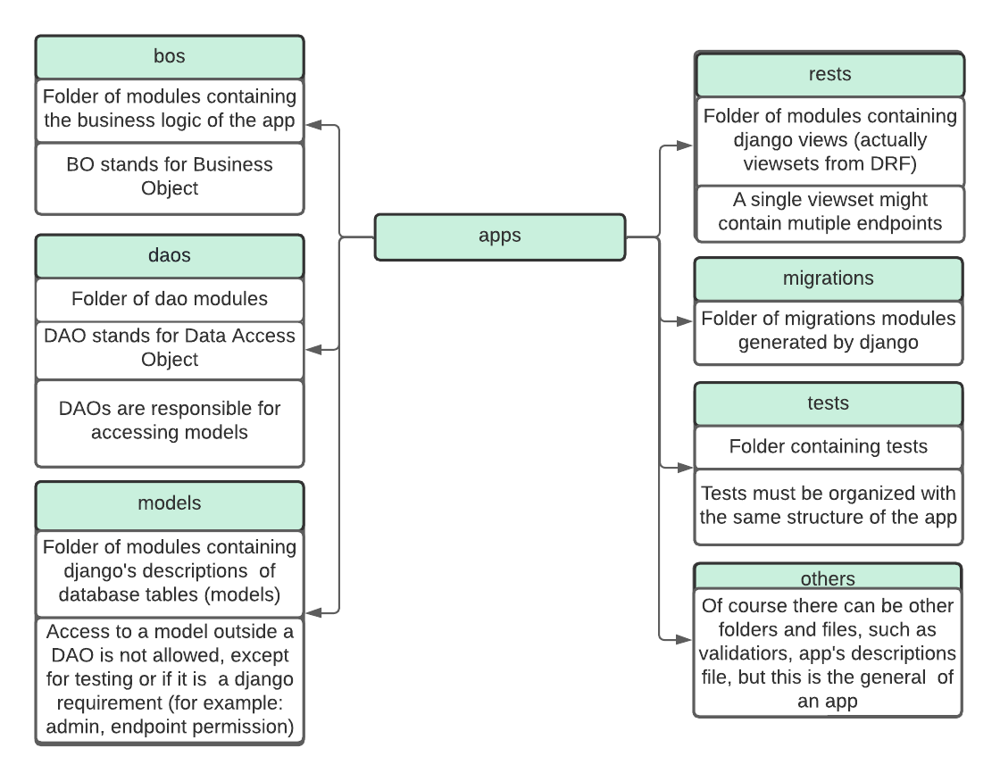

# Finding out chess pieces moves

## **Description**

Application that consists of registering chess pieces, or a board larger than the conventional one (8x8).  
In addition, given a location on a coordinate chosen by the user and the piece id,
if it is a knight, find out all possible locations where the knight can move in 2 turns.

### API

Some operations are performed with the api.

- Retrieve all chess pieces.
- Retrieve a chess piece using its id.
- Retrieve a chess piece id using your name and color attribute.
- Retrieve all chess boards.
- Retrieve an array of possible positions of a piece by passing a coordinate (in Algebraic notation) and a chess piece id.

### Technologies

#### Backend
- Python
- Django
- Django Rest Framework

### Architecture

Details on the architecture of the project. 

#### Backend

##### Backend Apps

### License

Licensed under the [MIT License](https://github.com/arthurlba1/finding-out-chess-pieces-moves/blob/master/LICENSE).
